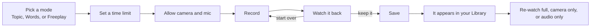
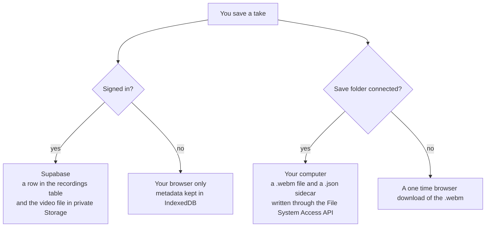

# Speakeasy

Speakeasy is a small web app for practicing public speaking. You pick a prompt, record yourself answering it on your camera and microphone, watch the clip back right away, and build a habit over time with a streak and a running total of minutes practiced.

Live at **https://speakeasy-beryl.vercel.app**

## What you can do

- Get a speaking prompt in one of three ways. Choose a topic by category and difficulty, get a single random word to riff on, or switch to Freeplay and record with no prompt at all.
- Set a time limit, then record straight from the browser. Nothing leaves your machine unless you are signed in and choose to save.
- Watch the take back immediately with a scrubber.
- Sign in with an email and a password to keep every recording in a private library that follows you across devices.
- Re-watch any saved take in the library as the full video, camera only, or audio only.
- Do the Daily Challenge, which is one shared prompt that is the same for everyone on a given day.
- Track your day streak, your total recordings, and your total minutes practiced.

## How a session works



## The three pages

| File | What it is |
| --- | --- |
| `index.html` | The landing page. It explains the app and links people into the studio. |
| `speakeasy.html` | The studio. This is where you pick a prompt, record, watch the take back, and see your Daily activity panel. |
| `library.html` | Your recordings library. It lists every saved take and lets you re-watch it different ways, rename it, change its category, or delete it. |

## Where your recordings live

A single recording can be stored in up to three places, and the app keeps them in step.



When you delete a recording in the library it is removed from Supabase, from the local browser database, and from the connected save folder, so your storage use drops everywhere at once. The Daily activity panel in the studio updates to match.

## Tech stack

- HTML for structure, CSS for styling, and plain JavaScript for all the logic. There is no framework and no build step. Each page is one file with its styles and scripts inline.
- `getUserMedia` and `MediaRecorder` for recording in the browser.
- Supabase for the account system, the Postgres database that stores recording metadata, and the private Storage bucket that holds the video files.
- The File System Access API for writing a local copy of each video to a folder you choose once.
- IndexedDB for local recording metadata and for remembering that save folder.
- Hosted on Vercel as a static site. Pushing to the `main` branch deploys to production automatically.

GitHub reports this project as almost entirely HTML because the CSS and JavaScript live inside the `.html` files. Measured by actual lines of code, most of the project is JavaScript.

## The prompt library

All 1,043 prompts are baked into `speakeasy.html` as a script block, so the page works even when it is opened straight from disk. `speakeasy-library.json` is the same data kept as a separate portable copy.

- **Topic mode** has 13 categories with 45 prompts each, and every prompt is rated easy, medium, or hard.
- **Words mode** has 8 categories of single words, rated the same way.
- The **Daily Challenge** picks one topic and one word per day, using the calendar date itself as the seed. Everyone sees the same pair for that day with no server involved.

## Run it locally

You only need a static file server. For example:

```bash
python3 -m http.server 8080
```

Then open http://localhost:8080/index.html

Signing in and cloud saving talk to a Supabase project whose public key is already in the code. Logged out use works offline, with recordings saved locally.

## Point it at your own Supabase project

Swap the project URL and public key near the top of the script in `speakeasy.html` and `library.html`, then run the SQL files in order in the Supabase SQL editor:

1. `supabase/schema.sql` creates the `recordings` table and its row level security policies.
2. `supabase/2026-09-08_library.sql` adds the extra columns and the private Storage bucket for the video library.
3. `supabase/2026-09-10_daily_limit.sql` adds the column that records the time limit chosen for a take.

Then turn off **Confirm email** under Authentication so a new sign up works without an email click.

## Project layout

```
index.html               landing page
speakeasy.html            the studio, with the prompt library inlined
library.html              the recordings library
speakeasy-avatars.js      30 profile icons, also inlined into the pages
speakeasy-library.json    portable copy of the 1,043 prompts
avatar-preview.html       a reference sheet of the avatar icons
supabase/                 the SQL you run once to set up the backend
PROGRESS.md               a running log of every change and decision
CLAUDE.md                 the project vision and working notes
```

## Status

Working now:

- Recording, instant playback, and local save
- Accounts, the private cloud library, and cross device sync
- Topic, Words, and Freeplay modes with the full prompt library
- The Daily Challenge with a per mode time limit
- The Daily activity panel with day streak, recordings, and minutes practiced
- Renaming, recategorising, and deleting takes from the library

Planned:

- Real transcripts from speech to text, which then unlocks words per minute and filler word counts
- Coaching notes from a language model, once transcripts exist
- Per recording notes that you write yourself
- A retention sweep that expires old cloud videos so the free storage tier lasts longer

## A note on storage

The free Supabase tier gives the whole project 1 GB of file storage, shared across every account rather than a gigabyte each. To make that last, video is captured at a capped bitrate of about 1 Mbps, which works out to roughly 8 MB per minute.
